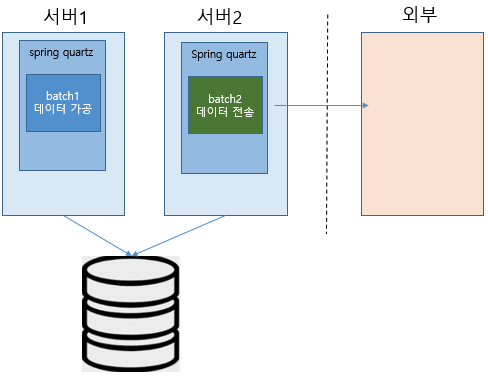
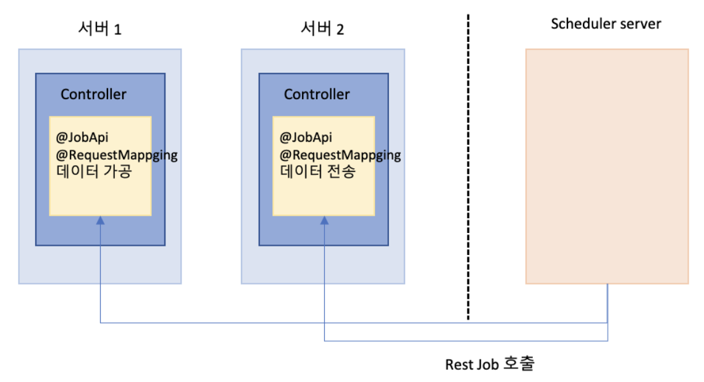

# prunus-scheduler
`prunus-scheduler`는 Quartz Job Scheduler 를 확장하여 Quartz의 그것과는 조금 다른 아키텍처 스타일로 
Job Scheduler를 제공합니다.

전통적인 Quartz Job Scheduler 의 아키첵처는 다음과 같습니다.

Quartz Job 동일한 Job 이 각각의 서버에 존재하며 Quartz Trigger 에 의해 Job 이 실행됩니다.   
이 때 Quartz Clustering 구성을 하지 않았다면 동일한 Job 이 각서버에서 실행되어 데이터 정합성을 보장하기 어럽게 만듭니다.
Quartz Clustering 환경 구성이 어렵지는 않지만 로컬, 개발, 운영 환경을 동일한 Quartz 설정으로
개발 및 테스트를 진행하다보면 의도치 않게 Quartz 가 Clustering 을 위해 관리하는 테이블의 Lock 이 발생하는 등
여러가지 신경써야 할 부분들이 생기게 마련입니다.

그리고 개발자가 Quartz JobDetail, Trigger, JobContext, JobDataMap 등 익숙하지 않은 개녕으로 개발 생산성이 낮아지고
또 장애 발생 시 장애 파악을 어렵게 합니다.

prunus-scheduler 는 일반적인 Spring Controller 기반으로 Job 이 구동되는 아키텍처를 가짐으로써
동일한 Job 의 동시 실행을 원천적으로 예방하고 또 일반적으로 Quartz Job 클래스의 테스트는 까다롭지만 prunus-scheduler 는 Rest API 호출을 통해
손쉽게 테스트할 수 있는 아키텍처로 구성되어 있습니다.

prunus-scheduler 는 scheduler server 가 따로 구동되고 scheduler server 가 특정 서버의
Rest api (Controller 의 Request mapping) 을 호출하는 아키텍처를 가지고 있습니다. 좀 더 자세한 아키텍처 설명은
prunus-scheduler 의 구성 모듈인 `prunus-scheduler-server`, `prunus-scheduler-client` 모듈에서
자세히 설명합니다.

[prunus-scheduler-server](prunus-scheduler-server-example/README.md)

[prunus-scheduler-client](prunus-scheduler-client-example/README.md)

## Test Client
prunus-scheduler 테스트는 다음 절차를 통해 테스트 해 볼 수 있습니다.
* prunus-scheduler-server, prunus-scheduler-client 를 실행합니다.
    * 보통의 spring boot 의 application 실행 방법과 동일합니다.
* 본인의 환경에 맞는 [Postman](https://www.postman.com/downloads/) 을 다운로드 및 설치합니다.
* **client** 디렉토리의 **prunus-scheduler.postman_collection.json** 파일을 Postman 에서 Import 하여 테스트 합니다.
